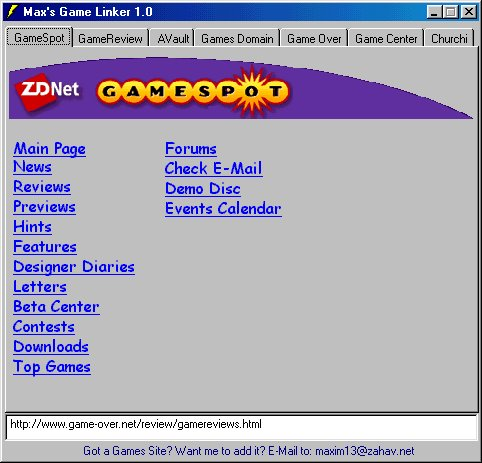



## GameLinker

### Description

The GameLinker is an application that containes a huge set of links from many game sites contents - including GameSpot, GamesDomain, AVault, GameCenter and more! - A really easy way to get cheats and hints for games ,read review/previews and much more :-)
 
### More Info
 

             |
---                |---
**Submitted On**   |2000-02-25 02:03:38
**By**             |[Max Raskin](https://github.com/Planet-Source-Code/PSCIndex/blob/master/ByAuthor/max-raskin.md)
**Level**          |Intermediate
**User Rating**    |3.5 (14 globes from 4 users)
**Compatibility**  |VB 5\.0, VB 6\.0
**Category**       |[Complete Applications](https://github.com/Planet-Source-Code/PSCIndex/blob/master/ByCategory/complete-applications__1-27.md)
**World**          |[Visual Basic](https://github.com/Planet-Source-Code/PSCIndex/blob/master/ByWorld/visual-basic.md)
**Archive File**   |[CODE\_UPLOAD35902242000\.zip](https://github.com/Planet-Source-Code/max-raskin-gamelinker__1-6244/archive/master.zip)

